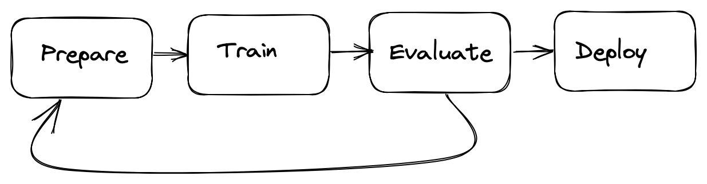

## Babelian Meetings

If you are into data science, you have probably become accustomed to the usual "prepare, train, evaluate" cycle of machine learning projects.

However, if you are working with non-technical clients and/or stakeholders, you will probably also run into evaluation meetings that look something like this:

On these occasions, my first thought is a quote from Douglas Adams:

> “A common mistake that people make when trying to design something completely foolproof, is to underestimate the ingenuity of complete fools.”

However, I must return to reality and admit that data scientists are also guilty.

We often forget that our extensive knowledge and technical jargon come from years of study and work in the field, and that our audience may not be familiar with this language.

Indeed, from the stakeholder's perspective, these meetings would probably look like this.

Machine learning models think with numbers, while we humans prefer to think using natural language or, more basically, cause and effect relations

This makes predictive models look like **weird black boxes with no clear explanation manual.**

This becomes a bigger issue when making decisions that affect real people, like loan approvals, medical treatments, military decisions, and more.

> [!question]
> Would you trust a **horse** to propose you a medical treatment ?

Probably no ? Right ?

What if the said horse was tested in a scientific setting and was found out to be capable of providing better diagnoses than any doctor, would you still be hesitant to trust it?

I understand your reluctance; I would probably feel the same way.

> [!important] The horse **wouldn’t** be able to **provide much explanation**, and how can I trust a decision if I don't understand it ?

Talking about horses, there is a funny story that has some meeting points with this article.

Probably is not completely related to our topic, but it is hilarious at least, so even if you dislike the article you could still enjoy the story.

## Hans the Horse

It was 1904 when a fascinating piece of news appeared in the New York Times, a correspondent from Berlin reported a remarkable event: a local landlord Herr von Osten, apparently trained his horse to answer human-level questions.

Hans, that was the name of the horse, was able to answer quite a range of different questions: from simple arithmetic calculations like sums and divisions, to more complex tasks such as recognizing people, colors, musical tones, and tools.

Although the story may seem straight out unbelievable for today standards, the world was a different place over a century ago, and the idea of a horse with such extraordinary abilities was definetely fascinating.

Even though the story was absurd, it was still somewhat plausible. The horse never learnt to speak and was limited to communicate trough the stomp of his hooves or by grabbing objects with his mouth.

The news rapidly spread across the globe ( another thing that was not so easy at the time) but it finally allowed some healthy skepticism started to arise.

In 1907 a German biologist and psychologist Oskar Pfungst performed a series of scientific trials on the horse to put these doubts to rest.

> Pfungst successfully demonstrated that the horse was not performing any of the expected reasoning, but rather interpreting involuntary cues from his owner.

> [!important] Can you see where I’m heading towards ?

## Hans and the black-box model

Hans the Horse was one of the first Black-Box models we can think about, Oskar Pfungst was basically trying to make it less opaque and to understand more about it’s inner working

- What happens if we perform the experiment without public ?
- What if someone that is not the owner asks the question ?

If we think for a moment, these are very simple and logical questions. They are somewhat similar to the ones we find in XAI

- What happens if we remove one of the features ?
- What happens if the data changes a lot ?
- What happens if we insert noise in the data ?

But in both cases the public ( or the stakeholders ) doesn’t get the chance to ask them, because these wonderful creatures are just far off their reach.

Summing it up, I think that the most important message is to remember why did we come up with **explainability.**

> Stakeholders need to **trust** AI models  
> In order to trust, humans need to **understand**  
> A basic component in understanding is the ability to ask answers and receive **explanations**

- What if we use a blinder to prevent the horse from using the surrounding context ?

In principle, you don’t need any fancy XAI technique in your projects, you just need to increase their transparency, and this can be done in thousands of different ways, let’s see some example

- The stakeholder needs a proof that the model doesn’t go nuts in unconventional scenarios ?
	Let’s build an interactive dashboard to allow people to test it out by themselves  
    
- The stakeholder needs to use the model in first person and wants a limited set of rule to support his decision-making process ?  
    Let’s use a tree-based model with a small depth  
    
- The stakeholder wants to allow the clients to directly ask the model ?  
	Maybe using a generative LLMs with smart prompt can be a better choice ?  
	
The take home message here is simple  
Focus on the quality and exhaustiveness of the answers, no prediction is meaningful without it