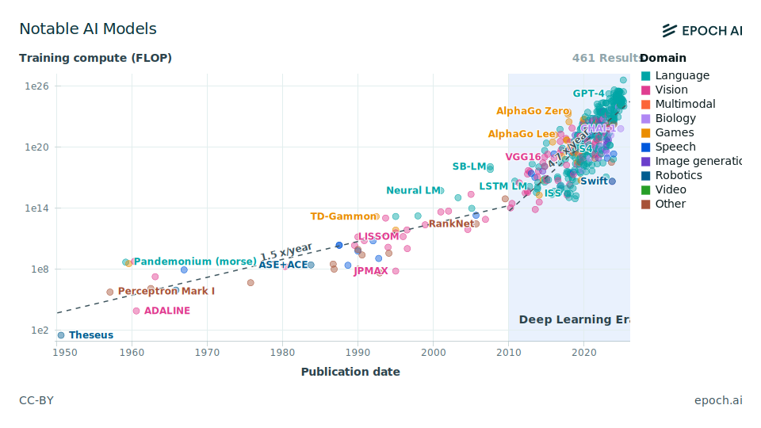
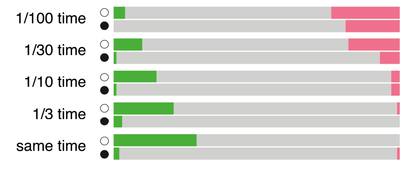
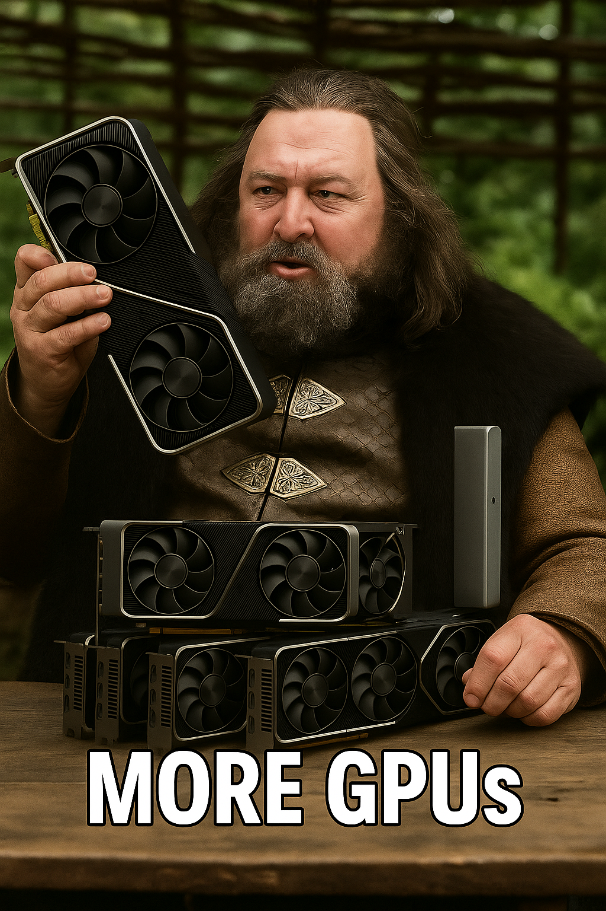
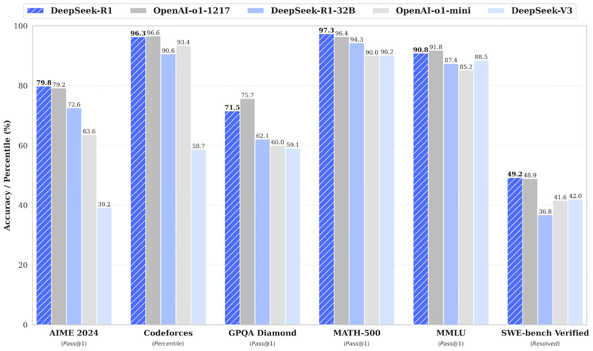
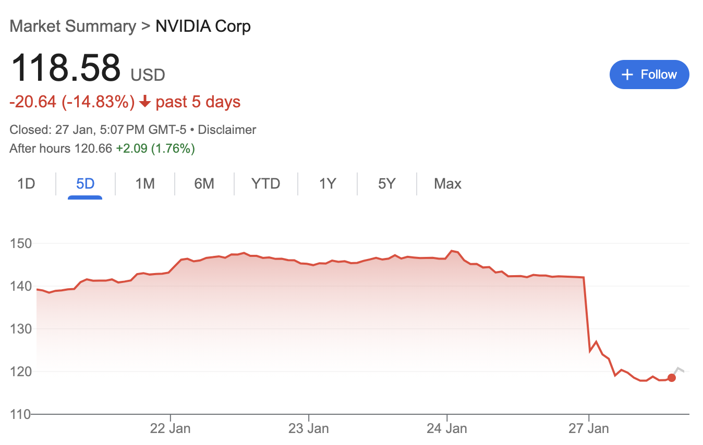

The idea behind this post was born after I attended an amazing talk by Lukasz Kaiser, one of the folks behind Attention Is All You Need.

He talked about how, from the inside, the whole transformer revolution felt a lot more incremental, almost natural than what the public opinion perceived

Instead of trying to recap his journey, I figured I’d tell my own: how a confused uni student accidentally wandered into the world of AI.

I have to admit that this post has been in draft state for so long that it might be just a few years away from becoming ‘how we reached AGI’

## \[→2016\] From Machine Learning to Deep Learning

My university journey began in 2016, and at that time the word AI was just very complicated statistics

But almost overnight, something was changing, something that would make the "fancy stats" look like ancient history.

To be honest I didn’t understand much of what was going on back then, but everything makes much more sense now in hindsight, I was entering uni at the beginning of the **Deep Learning Era**. What an amazing time to be alive, right ?

At the beginning I was just an outsider in the AI world, I was trying to figure out what the hell a python function is, and why Finite State Machines relate so closely with Regex Expression.

However, even If I wasn’t involved in first person, news travel fast in the uni, and I clearly remember the fervor when [AlphaGo](https://www.deepmind.com/research/highlighted-research/alphago) defeated the world champion of Go.

[https://www.youtube.com/watch?v=WXuK6gekU1Y](https://www.youtube.com/watch?v=WXuK6gekU1Y)

If you didn’t watch it, I highly suggest you to the documentary that Google DeepMind released about it.

I don’t want to delve into technicalities about why this was so revolutionary, but let’s try to summarise the key points

  

First of all, chess has already been dominated by computers for 20 years at this point in time, and it all started back in 1996, when the Chess world champion [Garry Kasparov](https://en.wikipedia.org/wiki/Garry_Kasparov) and has been defeated by IBM’s DeepBlue.

> [!important] What is so different with Go then ?

DeepBlue was a 2-ton purpose-built supercomputer specifically tailored to explore optimal moves. Its software and reasoning structure were developed together with several grandmasters, its entire essence was infused with chess knowledge, even its resistors could play better chess than me.

AlphaGo was developed on commercial grade hardware - lots of it to be honest - with amateur knowledge of Go and pretty generalizable AI algorithms.

At its core it was just learning by playing lots games with itself.

This apparently small difference had incredible implication

First: AlphaGo wasn’t just interpolating the existing knowledge we have of the game, it was learning optimal strategies by itself, extrapolating over the small set of games that humanity has played, the entire human knowledge of Go was just a bootstrapping procedure for him, a first step to get started.

This culminated in the famous Move 37 of the match with Lee Sedol, a completely unseen and un-understandable yet crushing move, that made the champion - and the rest of the Go community - realize that they’ve been playing just a bubble of what the game can offer.

Secondly, this learning algorithms are a lot more generalizable and don’t require much ( or possibly any ) domain knowledge to be effective, shortly after the release of AlphaGo, DeepMind released AlphaZero, that can be applied to any over-the-board-game ( [and not only](https://deepmind.google/technologies/alphafold/) )

Thirdly, this AI algorithms are a lot more efficient than a bruteforce search, when the Chess version of AlphaZero was released, [it was crushing StockFish](https://www.chess.com/news/view/updated-alphazero-crushes-stockfish-in-new-1-000-game-match), the most well known chess engine ( and Deepblue’s closest living relative ) that required around 30 times more time to be competitive with its AI-based counterpart

## \[2017→2018\] GPUs, Notebooks and Transformers

The first thing that occurs to my mind when looking back at this time is probably a motto saying: GPUs, GPUs, GPUs!

You could argue that this isn’t a distinctive trait of this timespan in particular, GPU race is still up and furious, and the competition for the computing resources has always being a fundamental component of AI research.

However the peculiarity of this time is that performant hardware for Model Training was pretty accessible, you didn’t need a multi-million dollar cluster, most people were training on one or two `980`, `1080`, `2080` and `2090` on a regular desktop, or maybe up to 8 using a server box.

If compared to their commercial counterparts like `P100` and `V100` they were incredibly price-efficient, you could get an entry-level training machine for 1-2k, a mid-range for 10k and a top-tier 8 GPU box for 100k.

In addition, if you were a cheap student at that time - like I was - you could always opt for running your code on Google Colab, Kaggle or any other notebook. Most of these services were giving out `GPUs` and `TPUs` for free, there were clearly lots of strings attached but It was generally feasible to rent a single GPU with somewere between 8 and 16GB of memory for a few hours, enuogh to run any uni-related experiment.

Yes, if you are from from US or Northern Europe it might seem cray that students din’t have access to University cluster, but that’s how it worked in my university, you’d need to be at least a contract researcher or PhD to get access to decent computational power

Even though the price bracket for accelerators seem comparable to what we see today, the main difference is that with a single high-end box you could be at the forefront of research back then.

To give some referece, the first Transformer from “_Attention Is all you need”_ has been trained on a few days on a `8 x P100`, in comparison the training of GPT-4 has been estimated to require around `20’000 x A100` for 3 months, we are speaking about at least 5 orders of magnitude, more than one per year.

## \[2019→2020\] A BERT for anything and the raise of Embeddings

Everybody - well it also includes me I guess - keeps mentioning **Attention Is all you need**, but to be honest I think that for all the practitioners **BERT** was way more relevant.

“Bidirectional Encoder Representations from Transformers” aka BERT was a model released by Google in 2019 and it was one of the biggest game changer in AI, its impact is probably comparable to ChatGPT itself in my opinion.

**BERT** was released as an open-source model together with its pretrained weights, meaning you didn’t need to train it from scratch — a massive barrier had just been lifted. Suddenly, anyone with some Python skills and a GPU could leverage state-of-the-art NLP without a data center or a research lab budget.

Even more impressively, fine-tuning BERT for specific tasks like sentiment analysis, question answering, or named entity recognition could be done on a **single commercial GPU**, often in just a few hours. This accessibility triggered an explosion of experimentation, especially from the fast-growing NLP community outside big tech.

But it wasn’t just about supervised fine-tuning. A quieter revolution was beginning: **embeddings**. You could take BERT, feed it some text, and get high-dimensional vector representations — numerical fingerprints that captured meaning in subtle, surprisingly effective ways. These embeddings quickly found a home in tasks like **topic clustering**, some early attempt at **semantic search**, and so forth

This whole movement gave rise to a powerful idea: **you could learn rich latent space representations of language with very minimal supervision**, and those representations could act as a _universal foundation_ for a growing number of downstream tasks.

This shift also planted the seeds for broader trends: **foundation models**, **transfer learning**, and **few-shot learning**. It suggested that rather than building hundreds of small models, we could invest in training large, general-purpose models and reuse them flexibly. And as people began experimenting, it became clear that **the latent space itself was becoming a platform** — a kind of semantic infrastructure you could build on top of, from search to clustering, summarization, classification, and beyond.

## \[2021→2022\] Scale up & ChatGPT

One of the coolest tricks that I didn’t mention about BERT is its **training objective** — and it’s worth pausing on, because it quietly redefined how we think about learning from text.

1. **Masked Language Modeling (MLM):** Random words in a sentence are masked out, and the model is trained to predict them using the surrounding context. This forces the model to deeply understand both directions of context — what comes before and after — hence “bidirectional.”
2. **Next Sentence Prediction (NSP):** The model is shown pairs of sentences and must predict whether the second sentence actually follows the first in the original text. This helps BERT learn relationships between sentences, which is crucial for tasks like question answering or entailment.

These two **self-supervised** objective functions require minimal effort to curate the data, allowing to easily build dataset of unprecedented size with minima human overlook, for instance BERT was specifically trained on Wikipedia (~2.5B words) and Google’s BooksCorpus (~800M words).

This trend has been then confirmed by **the Scaling Laws paper** published by OpenAI in 2020, this paper took a bold, empirical approach to a deceptively simple question: _What happens when we just make models bigger?_ Instead of focusing on architectural tweaks or task-specific tricks, the authors studied how performance changes as you scale up **model size, dataset size, and compute** — systematically and at a massive scale.

What they found was game-changing: **loss decreases predictably and smoothly as you increase scale**. There was no sharp diminishing return. In fact, larger models trained on more data just kept getting better — often in unexpected and emergent ways.

This discovery had profound implications, in particular it showed that generalization and capabilities weren’t just about clever architecture or hyperparameter tuning, but about **sheer scale and high-quality data**.

This suggested a very clear path to move forward, scaling and scaling until in November 2022 GPT-3.5 and ChatGPT have been released and the mayhem happened for the following months

## \[2023→2024\] Tooling and agents

The years following the release of ChatGPT have been among the most incredible I’ve ever witnessed.

Almost overnight, it felt like the world collectively flipped a switch. Every executive was suddenly jumping on the AI train, every company was throwing bags of money at anything with “GPT” in the name, but most importantly among us practitioners, almost nobody had a fucking clue of what was actually happening and how this things would be programmed in practice

It all stemmed from one striking realization: we suddenly had access to what I would — without hesitation — consider the closest thing we’ve seen to AGI. A single model that could perform a wide range of tasks, often with little to no explicit retraining. Ask it to summarize a paper, explain a complex theory, translate languages, generate code, or carry out a logical reasoning task — and it would _do it_. Not perfectly, but astonishingly well. And most importantly, _all with the same model_.

This wasn’t entirely unexpected. The 2020 paper _Language Models are Few-Shot Learners_ by Brown et al. introduced the world to GPT-3 and showed how scaling up transformer-based language models enabled them to generalize across tasks with minimal examples — few-shot, one-shot, even zero-shot. The key takeaway was simple yet radical: these models were _multitask learners_, capable of generalizing their understanding across domains purely from language prompts.

But what took the world by surprise was just how far this capability could be pushed. Almost immediately, people realized these models were fantastic translators. Then came the wave of programmers who discovered that the same model could also write decent code, given the right prompt. Not long after, researchers and developers found that, when carefully instructed and provided with the right context, LLMs could use external tools — like calling APIs, executing code, querying databases, or even controlling a browser.

This ushered in the era of _tool-augmented LLMs_, where the language model was no longer just a passive text generator but an active agent — one that could take actions in the world beyond just generating text. And once people realized that these models could use tools, the next question was obvious: to what extent could they operate autonomously?

From that point on, the experimentation never stopped. Autonomous agents, memory-augmented models, long-context systems, and recursive self-improvement ideas started flooding in. We weren’t just trying to generate better text anymore — we were exploring what it means to create systems that _reason_, _act_, and _learn_ in open-ended environments.

And still, many of us are trying to catch up — not just with the technology, but with the implications.

## \[2025→\] Deepseek and MCP

By the end of 2024 we can say that AI is becoming a commodity. Most website chatbots were finally useful - or at least they didn’t totally suck - everyone could easily generate pictures from a thought or idea and all the YC startups are trying to specialize LLMs to work on niece fields or automate the code development lifecycle even more.

Everything was running smoothly for NVIDIA and OpenAI executives, sipping whiskeys, admiring their hegemony in the AI and LLM world until, all of a sudden, an unknown chinese trading firm drops **DeepSeek V3** and **R1**, respectively a foundational and reasoning model and -let me say- they definitely weren’t yet another LLM.

**DeepSeek R1** was competitive, if not superior, to ChatGPT-o1, openAI’s leading  
it was open-sourced from day zero and it was a lot more efficient than the rest of LLMs.  

To put first in perspective, training their foundational model costed approximately $6 million, a stark contrast to the $100 million spent on training OpenAI's GPT-4 .

This was an earthquake, people started to think that maybe there was another way to improve the State of Art, rather than burning even more money on hardware ( like the [Stargate](https://openai.com/index/announcing-the-stargate-project/) project ) and therefore making NVIDIA plummeting a solid 15% overnight

The other biggest trend of 2025 ( so far ) is probably **Model Context Protocol (MCP)**, to be honest I am not particularly impressed by the protocol per-se, the first version of anything never really turns out well, there are competitors like google’s A2A and probably others lurking in the dark

The most interesting part of MCP is the traction and the resonance it got, clearly reflecting a common desire in the AI world to standardize LLMs interactions, allowing to build even more advanced and autonomous agents, rather than constantly rebuilding the same tool and functions like it’s happening now

This is the end of our voyage, thanks for reading so far, maybe I’ll update this post to keep up with advancements (probably not), let’s wait for the next breakthrough.