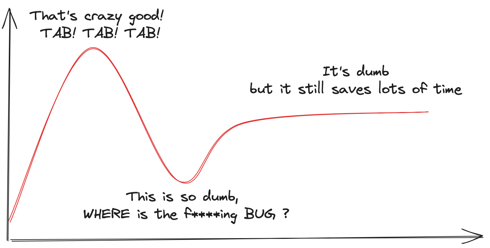
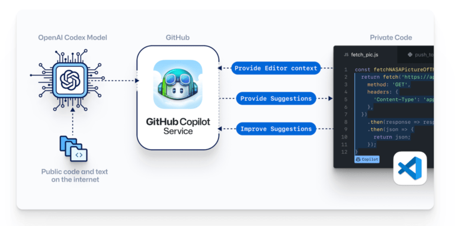

I’ve been using Copilot for almost three months now, and I feel confident enough to say that **it is a game-changer** indeed, but not in the way you might think !

My hype curve when I first tried it on was something like this



## Some examples

I’ve tried it in different contexts but some of the most useful applications i found were

- Open a csv with pandas

```Python
import pd as pandas
n26_csv_path = "data/transactions_n26.csv"
[🤖] n26_csv = pd.read_csv(n26_csv_path, sep=",", header=0, index_col=False)
```

- Disable CORS for newly created fastapi server

```Python
import fastapi
app = fastapi.FastAPI()
# Disable cors

[🤖] app.add_middleware(fastapi.middleware.cors.CORSMiddleware,
	                      allow_origins=["*"],
                        allow_credentials=True,
                        allow_methods=["*"],
                        allow_headers=["*"])
```

- Create the schema for a table

```Python
# Create database to store transactions
# "Date","Payee","Account number","Transaction type","Payment reference","Amount (EUR)","Amount (Foreign Currency)","Type Foreign Currency","Exchange Rate"
# "2021-07-25","JOHN DOE","","MasterCard Payment","","-5.2","-5.2","EUR","1.0"
# "2021-10-20","N26","","Income","Thank you for adding funds to your account using the card ending in *8835.","50.0","","",""
# "2021-10-20","N26","","Outgoing Transfer","N26 account instant top-up fee","-1.5","","",""
# "2021-10-20","GOOGLE *CLOUD_0157A9-C","","MasterCard Payment","","-18.23","-18.23","EUR","1.0"


[🤖] # Create table
create_table_statement = """
CREATE TABLE IF NOT EXISTS transactions (
    id SERIAL PRIMARY KEY,
    date DATE,
    payee VARCHAR(255),
    account_number VARCHAR(255),
    transaction_type VARCHAR(255),
    payment_reference VARCHAR(255),
    amount_eur FLOAT,
    amount_foreign_currency FLOAT,
    type_foreign_currency VARCHAR(255),
    exchange_rate FLOAT
);"""
```

- Parse and Format Python datetimes

```Python
def send_to_notion(self):
        transactions = self.get_all_transactions_n26()
        for transaction in transactions:
            print(transaction)
            # (350, datetime.date(2023, 5, 27), 'WWW.MYCICERO.IT', 'NaN', 'MasterCard Payment', '-', -4.5, -4.5, 'EUR', 1.0)
            json_properties = {
                "date": transaction[1].str[🤖]ftime("%Y-%m-%d"),
                "payee": transaction[2],
                "type": transaction[3],
                "amount_eur": transaction[6],
            }
            self._send_to_notion(json_properties)
```

## What works and what doesn’t ?

When I first used Copilot I was astonished!

Everything seemed so **plausible** that I just thought I could disconnect m brain, insert the autopilot and let the code flow…. unfortunately enough, I shortly realized that this approach just doesn’t work.

The code generated with autopilot is extremely **plausible** indeed, but is **constallated of small bugs** here and there

  

**The good:** Things that work flawlessly everytime

- **Skip trivial tasks**: Open a csv, plot a chart, insert debug logs and comments. Copilot can handle them effortlessly.
- **Manipulating entities**: For instance inserting data into a database ( without having to write every single variable assignment for every single property in every single function ) or write a new endpoint for a web service.
- **Expressiveness**: Suggested code is often clean and conform to linting standards, in addition it will use highly semantic names for function and variables and insert comments every couple of lines, it is very pleasant to read.

**The ugly**: Things that work once upon a time or require particular attention.

- **Size matters**: I used copilot in different codebases and a clear pattern emerged, **completion performances strongly correlate with training data availability.**  
      
    Therefore it works extremely well on widespread programming languages ( I tried Python and Javascript ) but rapidly decreases on marginal one ( like Svelte ) where it was simply burpling out random code, without even guessing the correct syntax  
    Same thing happens for library it works very well with matplot and numpy, but don’t you dare try to use it on smaller libraries, it will straight out invent method names !  
    
- **Performance**: **Copilot doens’t care about performance**, you can try to direct it a little bit through comments or function naming but it’s entirely up to you
- **Dumbness**: Don’t count on it to perform any logical reasoning that you deem counter-intuitive. If it’s not well-known and widespread Copilot won’t help you

**The bad**: Things that are often wrong, misleading or just evil

- **Subtle bugs:** Copilot is so good that it can create bugs that blend so well with the code that can trick also experienced developers! Making you cry in front of the code for hours, desperatly trying to address the problem  
    In some cases it’s just a dead end. The only way out is deleting the last 20 lines of code and start again, hoping to get in a different prediciton branch  
    
- **Unsafe code**: [Research](https://arxiv.org/pdf/2204.04741.pdf) have shown that Copilot can generate unsafe code, around 30% more than a human does.  
    Copilot claims that the new Codex version improved on this error, however no formal review compared the current status-quo  
    

- **Leakages**: this is not really a problem concerning the use of Copilot as such, this is a more generic problem with generative AI and the way it is trained i.e. scraping huge data sources, regardless of copyrights.  
    This can have a rather unpleasant effect of  
    [revealing -possibly secret- portions of training data to the general public](https://www.theverge.com/2023/1/17/23558516/ai-art-copyright-stable-diffusion-getty-images-lawsuit)  
    This also happened with Copilot, in particular due to the use of private repositories during training, leading to the  
    [leakage of API secrets, endpoints, database structures and so on](https://medium.com/@jankammerath/copilot-leaks-code-i-should-not-have-seen-e4bda9b33ba6).
- **Downskilling:** It’s still too early to be sure about code assistant effect on our coding skills, but in my opinion it’s reasonable to assume that it will have a non-negligible one.


[https://xkcd.com](https://xkcd.com/)

  

## CONTEXT, Context, context

Copilot is an LLM, trained to guess the next token(s) in a sentence, so it is basically trying to approximate

$$P(next\_token |context)$$

  
therefore it’s performance will be infulenced by two main factors:  

- **Context** Availability ( Quality of the code, verbosity, additional hints, … )
- Similar samples in github
- Entropy related to the choice ( is it a one-liner or a whole algorithm ?)

For what concerns the **context** we can try yo model it as a 3 level memory or state.



- **CONTEXT**: The biggest context is the one used for training, comprising of a corpus of coding files
- **Context**: The local context of your IDE, comprising of all the files in your projecct
- **context:** Last lines you wrote in the file: a comment or the function header

For what concerns the **entropy** the question is the following:

- Given the **Context** and the **context,** how many different completions do we observe in the **CONTEXT** ?

Clearly, the less choices we have the better the suggested code will be !

## What’s under the hood ?

Copilot is a closed source LLM model, therefore we don’t know so much about it.

According to wikipedia and a couple of brief searches I gathered the following information

- Copilot is powered by the [OpenAI Codex](https://en.wikipedia.org/wiki/OpenAI_Codex) model
- Codex is a refinement of GPT-3 that has been fine-tunded 54 million public GitHub repositories ( mostly of which were python-based )
- Open AI’s GPT-3 is licensed exclusively to [Microsoft](https://en.wikipedia.org/wiki/Microsoft), GitHub’s parent company.

## What’s about to come ?

Microsoft announced [Copilot X](https://github.com/features/preview/copilot-x), aiming to extend Copilot beyond the simple next token prediction, some of the most interesting aspects I can’t wait to try are:

- Chat-based interface: the new Copilot will allow developer to select code and then ask to work on it with a chat-based interface, for allowing to refactor it, generate test-cases and/or documentation
- Automatic commit and PR description

In addition they also aim to spread horizontally by integrating copilot in the command line interface.

Probably the day we can stop googling the correct flag placement for `tar` is closer than we expect !