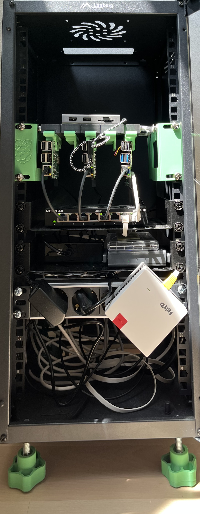
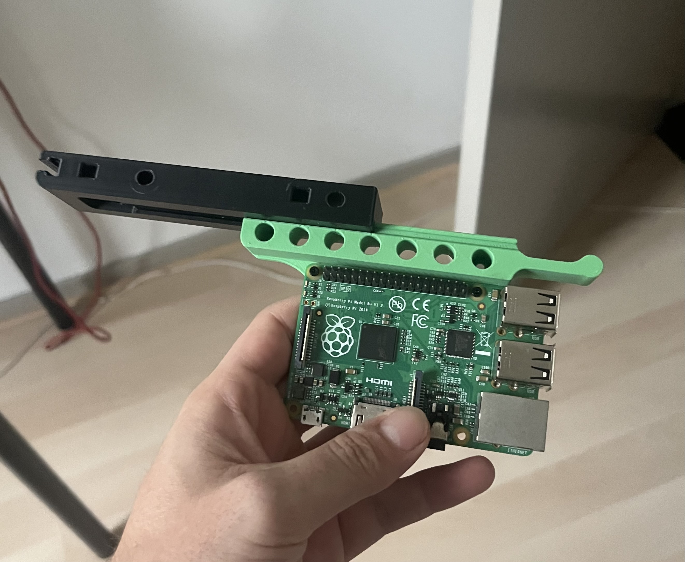
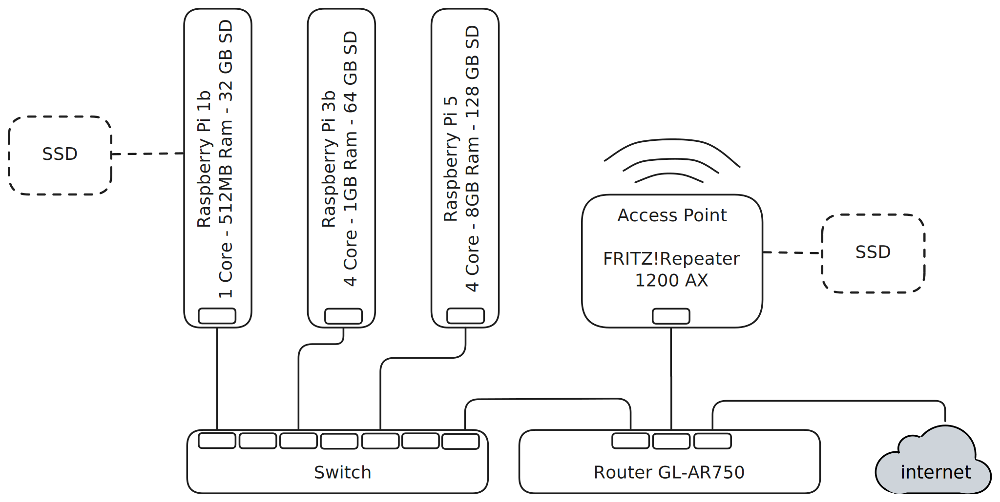

Since I started my career in Computer Science I always had an attraction towards dashboards and monitoring systems, it always gave me a sense of order and control. I’ve been lurking in the shadows of [r/homelab](https://www.reddit.com/r/homelab/) and [r/minilab](https://www.reddit.com/r/minilab/) for quite a while now, waiting to build have enough cash to build my shiny personal homelab.

Then I decided f**ck it, stop procastinating and let’s wire up the equipement I already have at hand, regardless of how good or bad it might be, I mean the whole point of it is to learn, right ?

## Hardware

I already had a few Raspberry Pi’s laying around, a pocket router and a repeater, it could have been enough but I decided to buy a new 8GB Ram Pi 5 to have a bit more computational power ( and threat myself a bit).

Then I bought a 10” rack and some trays and I 3d printed an assembly for the Raspberries with sliding trays to easily slide the PIs in and out

you might think this is isn’t much computing power anyways but

1. The latest Pi is actually a surprising beast
2. Even if it’s hard to believe, girlfriends aren’t a fan of homelabs ( and I work close to it half of the week ), therefore it **had** to be quiet !
### Bill Of Materials

| #   | Name                                                                                                                                                                                                               | Source | Price |
| --- | ------------------------------------------------------------------------------------------------------------------------------------------------------------------------------------------------------------------ | ------ | ----- |
| 1   | [Digitus DN-10-12U-B rack](https://www.dustin.nl/product/5011232261/dn-10-12u-b-rack-wandrek-zwart)                                                                                                                | 💰     | 73    |
| 2   | [Digitus HE Shelf 1U](https://www.amazon.nl/-/en/dp/B08T1TTQQC?ref_=ppx_hzod_title_dt_b_fed_asin_title_0_0&th=1)                                                                                                   | 💰     | 12    |
| 1   | [Digitus 4-way power strip 1U](https://www.amazon.nl/-/en/dp/B09M6W23ZM?ref_=ppx_hzod_title_dt_b_fed_asin_title_0_3&th=1)                                                                                          | 💰     | 20    |
| 1   | [Netgear GS308-300PES](https://www.amazon.nl/-/en/dp/B07PTTX7MX?ref_=ppx_hzod_title_dt_b_fed_asin_title_0_2&th=1)                                                                                                  | 💰     | 24    |
| 1   | iNet GL-AR750S                                                                                                                                                                                                     | ♻️     |       |
| 1   | [Raspberry Pi 5 8GB](https://www.amazon.nl/-/en/dp/B0CK2FCG1K?ref_=ppx_hzod_title_dt_b_fed_asin_title_0_1) + [Heatsink](https://www.amazon.nl/-/en/dp/B0CNVDF2MC?ref_=ppx_hzod_title_dt_b_fed_asin_title_0_4&th=1) | 💰     | 105   |
| 1   | Raspberry Pi 3b 1GB                                                                                                                                                                                                | ♻️     |       |
| 1   | Raspberry Pi 1b 512MB                                                                                                                                                                                              | ♻️     |       |
| 1   | [Renoga 50W 8 USB charger](https://www.amazon.it/dp/B0DDKY8S55?ref_=pe_24968671_487309461_302_E_DDE_dt_1&th=1)                                                                                                     | 💰     | 18    |
| 3   | [L-Shaped USB-C cable](https://www.amazon.it/dp/B092KF36T6?ref_=pe_24968671_487309461_302_E_DDE_dt_1&th=1)                                                                                                         | 💰     | 9     |
| 5   | Ethernet Jumper Cable                                                                                                                                                                                              | 💰     | 10    |
| 1   | Ethernet Cable                                                                                                                                                                                                     | ♻️     |       |
| 1   | [Raspberry Pi Rack Mount](https://www.thingiverse.com/thing:4756812)                                                                                                                                               | 🖨️    |       |
| 4   | M10x50mm Screws                                                                                                                                                                                                    | 💰     | 5     |
| 4   | [M10 knobs](https://makerworld.com/en/models/748617-knob-for-metric-screw-m5-to-m12?from=search#profileId-681972)                                                                                                  | 🖨️    |       |
Sources:
- ♻️ Recycled
- 💰 Purchased
- 🖨️ 3D Printed
## Logical view

The GL.iNet router will be the gateway of our network, also supporting VPN for accessing the homelab when out of home and possibly allowing to mount an external drive to it.

The access point for the house wifi is attached directly to the router, given that it has 2 LAN and 1 WAN ports.

The other LAN port is wired to a gigabit switch that connects the PIs, optionally Samba can be deployed on the PIs to attach additional drives

## Philosophy

Given that i’ve played around with raspberry PI several time and I had them wore in a broken rather than functional state, just to lose interest and leave them lying around I decided that the setup this time should be as reproducible and self-healing as possible.

In order to achieve it I thought what better than use two technologies I am familiar with and I really like: `Docker` and `Ansible` and store all the code in [github](https://github.com/di3go-sona/homelab/tree/main).

The idea is quite easy, use ansible to configure the infrastructure, when possible use `Dockerfile` and `docker-compose.yml` files to ensure portability of services

- update packages, setup network and mounts
- download and setup docker
- build and deploy containers for the following services

For what concern the services to configure

- Storage ( samba, transmission )
- Monitoring ( grafana + prometheus + exporters )
- Home Automation ( homeassistant )