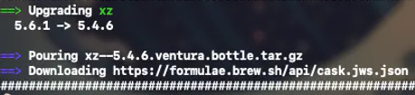

**The day is March 28th, 2024.**

I woke up, checked my phone, and noticed an unusual number of messages in the group chat—especially for a Saturday morning.

Turns out, someone had shared an article about the `xz` library being potentially backdoored.

"Yeah sure, let's have some cereal first."

It’s not uncommon to see headlines about some library being potentially vulnerable. Usually, it’s just an insanely skilled researcher finding an obscure memory glitch in a semi-unkown program that _could_ be weaponized—with lots of "ifs" and a ton of work—like Spectre, Meltdown, or the recent [Apple M-series chip vulnerability](https://mashable.com/article/apple-silicon-m-series-chip-vulnerability-hackers-encryption-keys).

Still, something felt off. So I went back to my phone, opened the article, and—**wow**—things immediately looked weird.

## What happened ?

The article included an [email](https://www.openwall.com/lists/oss-security/2024/03/29/4) from Andres Freund to oss-security, which opened in a rather straightforward way:

> Hi,  
>   
> After observing a few odd symptoms around  
> `liblzma` (part of the `xz` package), I figured out the answer:  
> […]  
> The upstream  
> `xz` repository and the `xz` tarballs have been **backdoored.**

Okay Andres you got my attention, go on

> One portion of the backdoor is **solely in the distributed tarballs** for 5.6.0 and 5.6.1  
> […]  
> That line is **not** in the upstream source of build-to-host, nor is in build-to-host used by `xz` in git.  
> […]  
> This i**njects an obfuscated script** to be executed at the end of configure. This  
> script is fairly obfuscated and data from "test" .xz files in the repository.  

Obfuscated payload in an open source repo ? This cannot be real

> This injects an obfuscated script to be executed at the end of configure. This  
> script is fairly obfuscated and data from "test" .xz files in the repository.  
>   
>   
> This script is executed and, if some preconditions match, it executes the following  
> [script](https://www.openwall.com/lists/oss-security/2024/03/29/4/1)

**No. F*****ing. Way

This is a textbook attack: a script whose source code is never publicly shown injects an obfuscated payload into… 🥁🥁🥁

>   
> == Impact on **sshd** ==  
>   
> The prior section explains that RSA_public_decrypt@....plt was redirected to  
> point into the backdoor code. The trace I was analyzing indeed shows that  
> during a pubkey login the exploit code is invoked  

Yes, **sshd**—the login daemon. The one that controls access to your entire system.

Honestly I don’t even need to see what this thing _does_. The sophistication of its deployment makes it a 10/10 threat already.

**This thing has the potential to grant unrestricted access to any machine in the world**

Do we really need more? I mean, what else could possibly go wrong?

This is only in the _testing_ branch, right? Right? It never made it to production… _rrright?_

Let’s check what version I have installed:

```Bash
$ xz --version                                                                                                                                                                                                                                                                                                                                               
> xz (XZ Utils) 5.6.1
> liblzma 5.6.1
```

oh nice, my pc is also infected… I mean, it could. At _least_ it appears that the malicious code only targets Linux

## Who is behind it ?

Okay, the story is mind-boggling. But if everything happened in plain sight, there should be traces.

Apparently, Hacker News was already flooded with posts. One of the top comments:

> Very annoying - the apparent author of the backdoor was in communication with me over several weeks trying to get xz 5.6.x added to Fedora 40 & 41 because of it's "great new features". We even worked with him to fix the valgrind issue (which it turns out now was caused by the backdoor he had added). We had to race last night to fix the problem after an inadvertent break of the embargo.  
> He has been part of the xz project for 2 years, adding all sorts of binary test files, and to be honest with this level of sophistication I would be suspicious of even older versions of xz until proven otherwise.  

And a few comments down:

> PSA: I just noticed homebrew installed the compromised version on my Mac as a dependency of some other package. You may want to check this to see what version you get

You are not alone buddy

I kept on reading until I found this amazing [real-time post](https://boehs.org/node/everything-i-know-about-the-xz-backdoor) and finally a name appeared: Jia Tan a.k.a [@JiaT75](https://github.com/JiaT75)

## Who is Jia Tan ?

The GitHub account had been created in 2021.

The first commits they made were not to `xz`, but they were deeply suspicious.

Specifically, they opened a PR in libarchive: [Added error text to warning when untaring with bsdtar](https://github.com/libarchive/libarchive/pull/1609).

This commit did more than it claimed. It replaced `safe_fprint` with an unsafe variant, potentially introducing another vulnerability. The code was merged without any discussion, and ~~[lives on to this day](https://github.com/libarchive/libarchive/blob/master/tar/read.c#L374-L375)~~ ([patched](https://github.com/libarchive/libarchive/pull/2101)).

This was probably his debut, testing the water, but Jia Tan had his eyes on a way bigger target

He contributed to different open source projects and he became particularly active in the `xz` community.

In April 2022, a sock puppet account, _Jigar Kumar_, appeared and pressured _Lasse Collin_, the maintainer of `xz` to get a new maintainer for the repo, exploiting a moment of vulnerability of the mantainer who was going trough a moment of mental fatigue

And who better than Jia Tan to take over the role ?

He was the perfect candidate, already familiar with the project, trusted by the community, the de-facto second in line

Through his new position, JiaT75 systematically unraveled his their malicious plan:

- Add hardware tests to the repo, increasing the amount and variety of files, making the upload of a malicious binary blob hardware to detect
- Migrated the testing and deployment infrastructure to a new one he owned
- Disabling `ifunc` checks in oss-fuzz (preventing Google's automated security tests from raising alerts)
- Update the exploit as a "test case dependency”
- Committed the malicious line that leverages the compromised library
- Used sock puppet accounts to push versions 5.6.0 and 5.6.1 into major repos, including:
    - [Debian](https://bugs.debian.org/cgi-bin/bugreport.cgi?bug=1067708)
    - Fedora
    - Arch
    - Homebrew
    - [1Password](https://github.com/jamespfennell/xz/pull/2)
    - And probably several more
- ~~Take over the world ?~~ Being exposed by someone that knows SSH so well to notice a few sub-second and decide to further investigate the matter

## Current state and final thoughts

I haven’t yet gone deep into what the backdoor _actually_ does, but here are some great resources for further digging:

- [https://gist.github.com/thesamesam/223949d5a074ebc3dce9ee78baad9e27](https://gist.github.com/thesamesam/223949d5a074ebc3dce9ee78baad9e27)
- [https://gynvael.coldwind.pl/?lang=en&id=782#stage2-ext](https://gynvael.coldwind.pl/?lang=en&id=782#stage2-ext)
- [https://bsky.app/profile/filippo.abyssdomain.expert/post/3kowjkx2njy2b](https://bsky.app/profile/filippo.abyssdomain.expert/post/3kowjkx2njy2b)
- [https://gist.github.com/smx-smx/a6112d54777845d389bd7126d6e9f504](https://gist.github.com/smx-smx/a6112d54777845d389bd7126d6e9f504)

---

## Post-mortem reflections

- This was close. Too close. And we can't even assume this was the first—or the last- for what is worth. It's simply the first large-scale attack **we've actually caught**.
- It's hard to believe this was the work of a lone actor. Honestly, I wouldn’t be surprised if we’re looking at a **state-sponsored APT**.
- This is **massive**. Everyone _knew_ something like this was possible. Now that it’s actually happened, I’m watching closely to see **how far the shockwaves travel**.

PS: It’s so weird seeing your package manager just casually downgrade a package… because, you know—it was malware.

