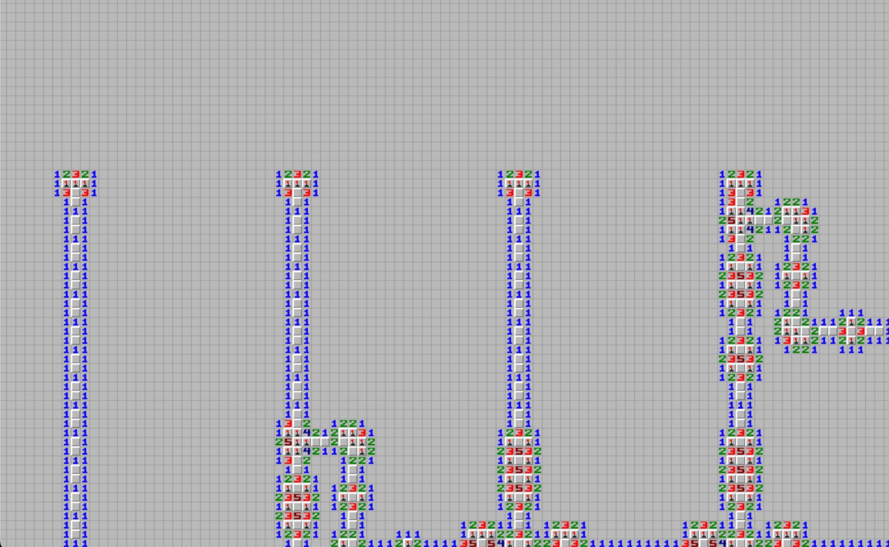

Even if I’m not fully into Cybersec anymore I still enjoy testing my skills with CTFs from time to time ( especially along the wonderful Hackappatoi team ) !

This challenge was quite fun and easy, you are given a simple python program that uses `pygame` to render a huge minesweeper board ( with a couple million cells )

In addition they also tried to force the board in a very peculiar case in which you couldn’t simply solve it greedily because you need some domino effect to clear the doubts about which mines to place



The two solutions I thought about where:

- Developing a custom algorithm to solve it, maybe using recursion ?
- Using a modeling approach to translate the game to a mathematical problem

Fortunately enough I immediately found this [wonderful article](https://massaioli.wordpress.com/2013/01/12/solving-minesweeper-with-matricies/) from Robert Massaioli that teaches you how to translate a minesweeper board to a system of linear equations.

Basically you need to generate an equation for each constraining cell ( the ones with numbers ) and a variable to each closed cell.

Solving the system is then quite straightforward using `z3`

```Python
from tqdm import tqdm
from z3 import Int, Solver, ArithRef, sat, simplify
import code

grid = []
with open('gameboard.txt', 'r') as fin:
    circuit = fin.read()
    circuit = circuit.replace(' ', '0')
    for line in tqdm(circuit.split('\n')):
        grid_line = []
        for cell in line:
            if cell == 'B':
                value = -1
            elif cell in "012345678":
                value = int(cell)
            else:
                value = None
            grid_line.append(value)
        grid.append(grid_line)


def get_cell_name(x, y):
    return f'x_{x}_{y}'

def get_cell_value(x, y, grid):
    return grid[x][y]

def get_cell(x, y, grid):
    return Int(get_cell_name(x, y)), get_cell_value(x, y, grid)


def get_neighbours(x, y, grid):
    neighbours = []
    for i in range(-1, 2):
        for j in range(-1, 2):
            if (i == 0) and (j == 0):
                continue
            if (x+i < 0) or (y+j < 0):
                continue
            if (x+i) >= len(grid) or y+j >= len(grid[x+i]):
                continue
            neighbours.append((x+i, y+j))
    return neighbours

# Generate the equation system
equations = []
for x in tqdm(range(len(grid))):
    for y in range(len(grid[x])):

        cell_name, cell_value = get_cell(x, y, grid)
        if (cell_value is not None) and (cell_value > 0):

            neighs_positions = get_neighbours(x, y, grid)

            neigh_cell_values = [get_cell_value(x_neigh, y_neigh, grid) for x_neigh, y_neigh in neighs_positions]
            neigh_cell_names = [get_cell_name(x_neigh, y_neigh) for x_neigh, y_neigh in neighs_positions]

            neigh_valid_cell_names = [Int(name) for value, name in zip(neigh_cell_values, neigh_cell_names) if (value is None)]
            neigh_valid_cell_values = [-value for value, name in zip(neigh_cell_values, neigh_cell_names) if (value is not None) and (value < 0)]

            equation = (cell_value == sum(neigh_valid_cell_names + neigh_valid_cell_values))
            
            if not isinstance(equation, bool):
                for valid_cell_name in neigh_valid_cell_names:
                    equations.append(equation)
                    equations.append(valid_cell_name >= 0)
                    equations.append(valid_cell_name <= 1)


# Solve the system
try:
    print(f"Try to solve for {hint}")
    s = Solver()
    for equation in tqdm(equations):
        s.add(equation)


    for i in range(10):
        res = s.check()
        print(f"Result {i}: {res}")

        model = s.model()
        print(model)
        with open(f'model_{i}.txt', 'w') as fout:
            for line in model:
                out_line = f'{line} {model[line]}\n'
                fout.write(out_line)

except KeyboardInterrupt:
    code.interact(local=locals())
except Exception as e:
    print(e)
    exit()
```

This will generate a simple mapping file like this

```Python
x_590_211 1
x_211_2894 1
x_550_211 1
x_1242_680 0
x_70_211 1
....
```

Now you can use the solution to overwrite the original board, open the game, press `m` to get the flag and the job is done !